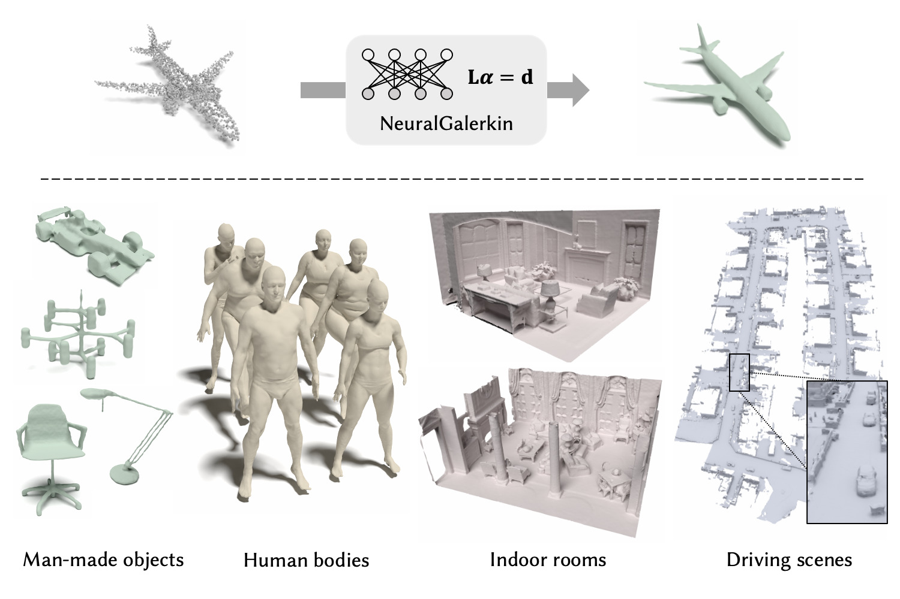

# A Neural Galerkin Solver for Accurate Surface Reconstruction

### [**Paper**]() | [**Project Page**]()



This repository contains the implementation of the above paper. It is accepted to **ACM Siggraph Asia 2022**.
- Authors: [Jiahui Huang](https://cg.cs.tsinghua.edu.cn/people/~huangjh/), [Hao-Xiang Chen](), [Shi-Min Hu](https://cg.cs.tsinghua.edu.cn/shimin.htm)
    - Contact Jiahui either via email or github issues.


If you find our code or paper useful, please consider citing
```bibtex

```

## Introduction

This repository is divided into two parts:
- `pytorch_spsr`: A GPU-accelerated differentiable implementation of Screened Poisson Surface Reconstruction (SPSR) using PyTorch.
- `neural_galerkin`: The learning part in the paper that is dependent on `pytorch_spsr`, including the adaptive CNN, data loader and the full training/evaluation scripts.

## Getting started

🌱 If you just want to use `pytorch_spsr`, then simply install it like a standard Python package, because the module is compatible with `setuptools`:
```shell
# Install ninja-build if it's not there
pip install ninja

# Install pytorch_spsr. Parallel build with MAX_JOBS=XX
python setup.py install

# If you want to develop locally:
# python setup.py develop
```

🌟 If you want to reproduce results from our paper, you don't have to install `pytorch_spsr` to your Python package registry. Instead, we suggest to use [Anaconda](https://www.anaconda.com/) to manage your environment. Following is the suggested way to install the dependencies:

```bash
# Create a new conda environment
conda create -n ngs python=3.10
conda activate ngs

# Install PyTorch (this may require upgrade your driver, why not)
conda install pytorch cudatoolkit=11.6 -c pytorch -c conda-forge

# Install other packages
pip install -r requirements.txt

# Compile pytorch_spsr CUDA extensions inplace
python setup.py build_ext --inplace
```

## Using `torch-spsr`

After installing `torch-spsr` package, you may use it in either of the following two ways:

1. Using the wrapper function to obtain the triangle mesh directly (see `python examples/main.py`):

```python
import torch_spsr

v, f = torch_spsr.reconstruct(
  pts,          # torch.Tensor (N, 3)
  pts_normal,   # torch.Tensor (N, 3)
  depth=4, 
  voxel_size=0.002
)
# v: triangle vertices (V, 3)
# f: triangle indices (T, 3)
```

The resulting triangle mesh representation can be visualized using:
```python
from pycg import vis
vis.show_3d([vis.mesh(v, f)])
```

2. Using the `Reconstructor` class to obtain a differentiable implicit function:

```python
from torch_spsr.core.hashtree import HashTree
from torch_spsr.core.reconstructor import Reconstructor
from torch_spsr.bases.bezier_tensor import BezierTensorBasis

hash_tree = HashTree(pts, voxel_size=0.002, depth=4)
hash_tree.build_encoder_hierarchy_adaptive(min_density=32.0)
hash_tree.reflect_decoder_coords()

# Splat point normals onto the tree
normal_data = {}
sample_weight = 1.0 / hash_tree.xyz_density
for d in range(hash_tree.depth):
    depth_mask = hash_tree.xyz_depth == d
    normal_data_depth = hash_tree.splat_data(
        pts[depth_mask], hash_tree.DECODER, d, 
        pts_normal[depth_mask] * sample_weight[depth_mask, None]
    )
    normal_data[d] = normal_data_depth / (hash_tree.get_stride(hash_tree.DECODER, d) ** 3)

# Perform reconstruction
reconstructor = Reconstructor(hash_tree, BezierTensorBasis())
reconstructor.sample_weight = sample_weight
reconstructor.solve_multigrid(
    hash_tree.depth - 1, 0, normal_data,
    screen_alpha=4.0, screen_xyz=pts, solver="pcg"
)

# Evaluate the implicit function: suppose query_pos is torch.Tensor (M, 3)
f_val = reconstructor.evaluate_chi(query_pos)   # -> (M,)
```

## Reproducing our results 
